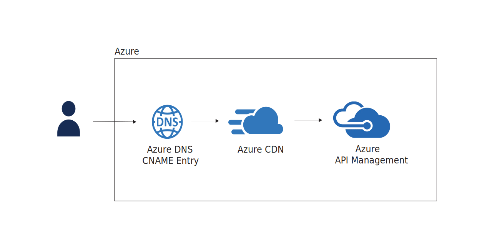

# Azure API Management



This Terraform module provides the required infrastructure to create an API Management with a custom subdomain.

[](https://github.com/messeb/terraform-az-apim/actions)
[](https://github.com/messeb/terraform-az-apim/blob/main/LICENSE)
[](https://github.com/messeb/terraform-az-apim/issues)
[](https://github.com/messeb/terraform-az-apim/issues?q=is%3Aissue+is%3Aclosed)
[](https://github.com/messeb/terraform-az-apim)
[](https://github.com/messeb/terraform-az-apim)

## Details

* Creates an Azure API Management instance in the specified resource group.
* Adds a custom domain to the API Management instance.
* Adds logging to the API Management instance.

## Usage

```hcl
module "apim" {
  source = "https://github.com/messeb/terraform-az-apim"

  resource_group_name = "az-apim"
  resources_base_name = "az-apim"
  location            = "westeurope"
  publisher_email     = "johndoe@example.com"
  publisher_name      = "John Doe"
  sku_name            = "Consumption_0"

  api_keys = [
    {
      name = "ApiKey01"
      key  = "cologne-4711"
    }
  ]

  sub_domain_dns = {
    resource_group_name = "example"
    zone_name           = "example.com"
    root_domain         = "example.com"
    sub_domain_name     = "api"
  }
}
```

## Example

[Example Usage](example/)

## Resources

| Name | Type |
|------|------|
| [random_uuid.uuid](https://registry.terraform.io/providers/hashicorp/random/latest/docs/resources/uuid) | resource |
| [random_string.rnd](https://registry.terraform.io/providers/hashicorp/random/latest/docs/resources/string) | resource |
| [azurerm_resource_group.rg](https://registry.terraform.io/providers/hashicorp/azurerm/latest/docs/resources/resource_group) | resource |
| [azurerm_application_insights.api-insights](https://registry.terraform.io/providers/hashicorp/azurerm/latest/docs/resources/application_insights) | resource |
| [azurerm_api_management_logger.logger](https://registry.terraform.io/providers/hashicorp/azurerm/latest/docs/resources/api_management_logger) | resource |
| [azurerm_api_management_diagnostic.diag](https://registry.terraform.io/providers/hashicorp/azurerm/latest/docs/resources/api_management_diagnostic) | resource |
| [azurerm_api_management.apim](https://registry.terraform.io/providers/hashicorp/azurerm/latest/docs/resources/api_management) | resource |
| [azurerm_api_management_subscription.subscriptions](https://registry.terraform.io/providers/hashicorp/azurerm/latest/docs/resources/api_management_subscription) | resource |
| [azurerm_cdn_profile.apim-cdnprofile](https://registry.terraform.io/providers/hashicorp/azurerm/latest/docs/resources/cdn_profile) | resource |
| [azurerm_cdn_endpoint.apim-endpoint](https://registry.terraform.io/providers/hashicorp/azurerm/latest/docs/resources/cdn_endpoint) | resource |
| [azurerm_dns_cname_record.cname_record](https://registry.terraform.io/providers/hashicorp/azurerm/latest/docs/resources/dns_cname_record) | resource |
| [azurerm_cdn_endpoint_custom_domain.cdn_custom_domain](https://registry.terraform.io/providers/hashicorp/azurerm/latest/docs/resources/cdn_endpoint_custom_domain) | resource |
| [null_resource.destroy_cname_record](https://registry.terraform.io/providers/hashicorp/null/latest/docs/resources/resource) | resource |

## Inputs

| Name | Description | Type | Default | Required |
|------|-------------|------|---------|:--------:|
| resource_group_name | Resource group in which the resources will be created. | `string` | n/a | yes |
| resources_base_name | Basename for all of the resources. | `string` | n/a | yes |
| location | Azure cloud region | `string` | n/a | yes |
| publisher_name | Name of the publisher | `string` | n\a | yes |
| publisher_email | Email of the publisher | `string` | n\a | yes |
| sku_name | SKU of Application Management service | `string` | `"Consumption_0"` | no |
| api_keys | List of api keys | `list(object)` | `[]` | no |
| sub_domain_dns.resource_group_name | Resource group of the DNS zone of the root domain | `string` | n/a | yes |
| sub_domain_dns.zone_name | Zone name of the root domain | `string` | n/a | yes |
| sub_domain_dns.root_domain | Root domain of the website | `string` | n/a | yes |
| sub_domain_dns.sub_domain_name | Sub-domain of the website | `string` | n/a | yes |

## Outputs

| Name | Description |
|------|-------------|
| api_management_url | The HTTPS-URL of the CDN endpoint of the API Management. |
| api_management_name | Name of the API Management. |
| api_management_resource_group_name | Resource group name of the API Management. |
| api_management_location | Location of the API Management. |
